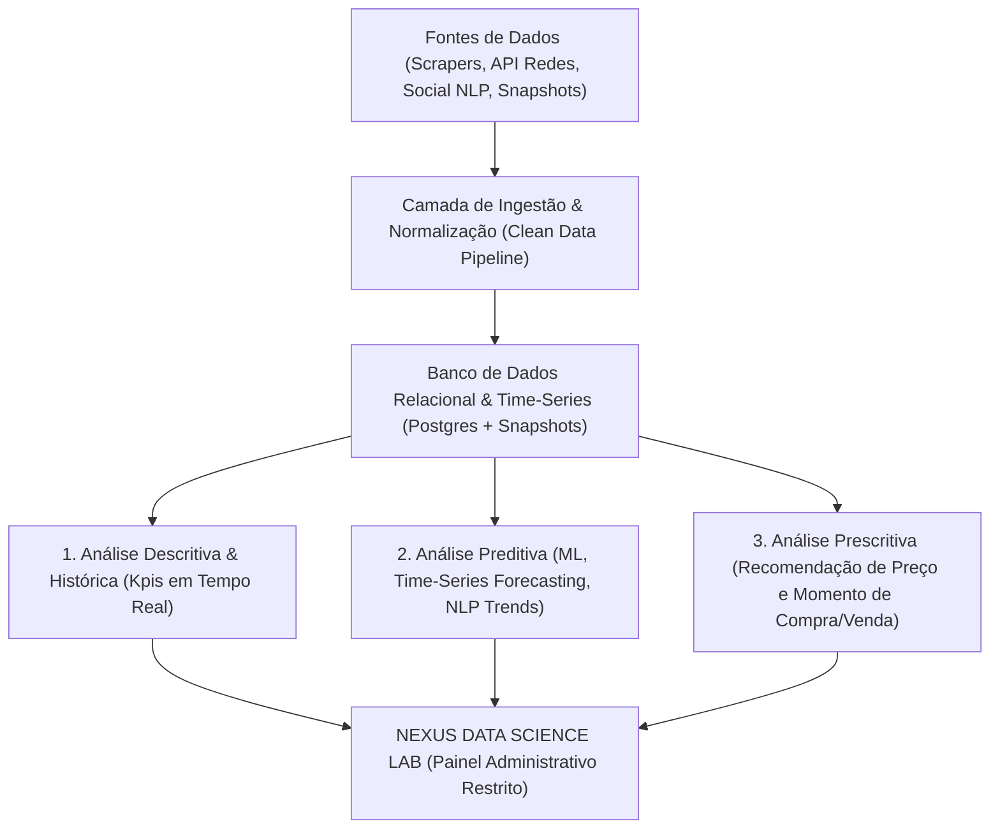

# Plano Mestre de Ciência de Dados, Analytics & Inteligência de Negócio Gamer
## Espaço Geek 86 — Framework Metodológico e Arquitetural (Big Data & Machine Learning)

> **Autor / Perspectiva**: Doutorado em Estatística, Ciência de Dados e Engenharia de Software  
> **Data de Homologação**: 2026-07-26  
> **Status**: Arquitetura Mestra para Implementação por Etapas e Escala de Big Data

---

## 1. Visão Geral e Propósito do Sistema de Inteligência

O **Espaço Geek 86** opera na interseção entre um *Marketplace Gamer C2C/B2C*, um *Agregador de Ofertas de Afiliados* e um *Observatório de Mercado*. Para capacitar vendedores (colecionadores e lojas) e compradores a tomarem as decisões mais lucrativas e inteligentes, desenvolvemos um ecossistema estatístico baseado em três pilares metodológicos:



---

## 2. As Três Dimensões da Modelagem Estatística

### 2.1 Análise Descritiva (O que está acontecendo agora?)
- **Volatilidade de Preço de Mercado ($\sigma_p$)**: Desvio padrão ponderado dos preços praticados por vendedores em relação à média histórica ($\bar{P}_{30d}$).
- **Índice de Liquidez do Produto ($L_i$)**: Razão entre a velocidade de mudança de status da oferta (ativa $\to$ encerrada/esgotada) e a quantidade de visualizações/cliques.
- **Desconto Ajustado por Outliers ($D_{adj}$)**:
  $$D_{adj} = \frac{\bar{P}_{clean} - P_{atual}}{\bar{P}_{clean}} \times 100$$
  onde $\bar{P}_{clean}$ exclui automaticamente cotações que excedam $2 \times \text{média bruta}$.

### 2.2 Análise Preditiva (O que vai acontecer a seguir?)
- **Modelagem de Séries Temporais (ARIMA / Prophet / XGBoost)**:
  - Previsão da curva de preço para os próximos 30, 60 e 90 dias com intervalo de confiança de 95%.
  - Identificação de **sazonalidade** (ex: valorização de mídias físicas no final de ano vs. ofertas de Summer Sale em mídias digitais).
- **Processamento de Linguagem Natural (NLP) e Análise de Sentimento**:
  - Scraping e leitura contínua de discussões em redes sociais (X/Twitter, Reddit `r/GameDeals`, YouTube, Instagram, fóruns retrogaming).
  - VET (Valor Emocional do Título) e Classificação de Polarity (-1 a +1) via modelos de linguagem (BERT/RoBERTa calibrados em PT-BR e terminologia geek).
  - **Identificação de Hype Relativo ($H_r$)**:
    $$H_r = w_1 \cdot \text{Mensões}(24h) + w_2 \cdot \text{Sentimento Positivo} + w_3 \cdot \Delta \text{Commits GitHub/Emuladores}$$

### 2.3 Análise Prescritiva (Qual ação o usuário deve tomar?)
- **Algoritmo de Prescrição para o Comprador**:
  - `COMPRA IMEDIATA (GREAT_DEAL)`: $P_{atual} \le \text{Min Histórico} \lor (P_{atual} \le \bar{P} - 1.5 \sigma)$.
  - `AGUARDAR (WAIT)`: Preço atual acima da média móvel de 30 dias e com tendência de queda identificada no modelo ARIMA.
- **Algoritmo de Prescrição para o Vendedor (Precificação Dinâmica)**:
  - Sugestão de valor de abertura para **Drops Hype Zone** e **Leilões Geek Hammer** para maximizar a conversão sem perder margem de lucro.

---

## 3. Arquitetura do Banco de Dados e Preparação para Big Data

### 3.1 Estrutura de Ingestão e Armazenamento

```
+-----------------------------------------------------------------------+
|                       ESTRUTURA DE DADOS                              |
+-----------------------------------------------------------------------+
| 1. affiliate_offers          -> Anúncios ativos e preços correntes   |
| 2. affiliate_price_snapshots -> Histórico bruto de cotações (Milhões) |
| 3. nlp_social_trends         -> Menções, sentimento e termos em alta  |
| 4. repo_activity_logs        -> Commits e atividade em emuladores/roms|
| 5. user_interaction_logs     -> Cliques, favoritos e pesquisas       |
+-----------------------------------------------------------------------+
```

### 3.2 Tabela Mestra de Tendências Sociais (`nlp_social_trends`)
*(Tabela projetada no schema do Postgres para o módulo de NLP)*:
- `id` (uuid, PK)
- `master_product_id` (uuid, FK)
- `keyword` (text)
- `source_platform` (enum: twitter, reddit, youtube, instagram, web_article)
- `sentiment_score` (numeric: -1.0 a +1.0)
- `mention_volume_24h` (integer)
- `hype_index` (numeric: 0 a 100)
- `collected_at` (timestamp)

---

## 4. Roteiro Metodológico por Fases

| Fase | Etapa | Descrição | Status |
|---|---|---|---|
| **Fase 1** | Ingestão e Modelo Base | Cálculo em tempo real de Preço Médio Limpo, Menor Histórico, Outlier Filter (2x raw avg) e 3 KPI Globais na Home | **Concluído & Homologado** |
| **Fase 2** | Dashboard Admin (NEXUS Lab) | Esqueleto do Painel Administrativo de Ciência de Dados com KPI's em tempo real e Mockups de Modelos de ML | **Em Implementação** |
| **Fase 3** | Ingestão de Sentiment NLP | Workers de segundo plano consumindo menções sociais e classificando sentimento em tempo real | *Próxima Etapa* |
| **Fase 4** | Time-Series Forecasting | Modelo preditivo ARIMA/Prophet integrado ao gráfico da Bolsa Gamer (`/monitoramento`) | *Próxima Etapa* |
| **Fase 5** | Motor Prescritivo Vendedor | Recomendação de preço de partida para leilões e drops com base no Hype Index social | *Próxima Etapa* |

---

## 5. Práticas de Segurança e Isolamento do Módulo

1. **Acesso Exclusivo**: O painel **NEXUS Data Science Lab** (`/admin/data-science`) é acessível **exclusivamente por Administradores autenticados** (`profile.role === 'admin'`).
2. **Proteção por Middleware e Guardas de Rota**: A rota é protegida por `requireAdmin()`.
3. **Isolamento de Carga (Read Replicas)**: Queries de Big Data e agregação temporal utilizam CTEs otimizadas ou réplicas de leitura para não afetar o desempenho da loja de varejo.
